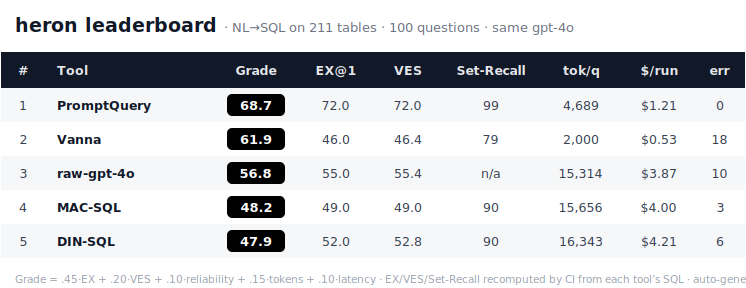

# heron — a production-scale NL→SQL benchmark

**The text-to-SQL benchmark that runs on a database shaped like production:** one multi-tenant SaaS
schema, **211 FK-linked tables across 14 domains**, seeded deterministically with **millions of
rows** of skewed, dirty-but-valid data, and a 100-question suite with **gold SQL scored by
execution-equality** — plus a first-class **schema-retrieval-at-scale** axis (*can a tool find the
right ~5 tables among hundreds?*), a correctness-gated **efficiency score (VES)**, and **exact
OpenAI-billed token/cost** accounting.

## 🏆 Leaderboard

[](leaderboard.csv)

_Every tool generates SQL with the **same `gpt-4o`** — the only difference is how each ingests the
211-table schema and selects tables. **Auto-generated by CI** from [`submissions/`](submissions/):
every metric except token count is **recomputed by re-running each tool's SQL** against the gold
database, so accuracy can't be self-reported. Machine-readable: [`leaderboard.json`](leaderboard.json)
· [`leaderboard.csv`](leaderboard.csv). Deep-dive, per-bucket breakdown, and tool cards:
[`docs/CROSS-TOOL-LEADERBOARD.md`](docs/CROSS-TOOL-LEADERBOARD.md)._

## Run it locally

```bash
make up                                          # Postgres 16 in Docker (or point DSN at any PG)
make schema                                      # load the 14-module schema (211 tables)
make seed SCALE=small SEED=42                    # deterministic data (4.4M rows); SCALE=tiny for a fast smoke
make verify                                      # referential-integrity + invariants must pass
make bench ADAPTER=gold                          # sanity: 100% EX / 100% Set-Recall
make bench ADAPTER=raw-llm     MODEL=openai/gpt-4o
make bench ADAPTER=promptquery MODEL=openai/gpt-4o   # needs `pip install promptquery`
```

`make bench` runs all 100 questions and prints EX / VES / Set-Recall / tokens / **$ cost**. To
reproduce the exact published database, `make restore` from the frozen dump instead of regenerating.

## Add a new tool

Adding your NL→SQL tool is the contribution we want most — and it's a few steps:

```bash
# 1. write harness/adapters/<name>.py  (subclass Adapter; generate SQL with the same gpt-4o)
# 2. run it on the suite
make bench ADAPTER=<name> MODEL=openai/gpt-4o
# 3. package the submission folder (adapter + results + meta)
python harness/make_submission.py results_<name>.json --tool "<Display Name>" --repo <your-repo>
# 4. commit submissions/<name>/  and open a PR (use ?template=add-a-tool.md)
```

When the PR lands, the **bot re-runs your SQL** to verify the numbers are genuine, then regenerates
the leaderboard — **you never edit the leaderboard.** Full guide + rules (same-model control, real
token capture): [`CONTRIBUTING.md`](CONTRIBUTING.md).

## Submit a new benchmark for an existing tool

Re-ran a tool already on the board (new version, new prompt, a fix)? Just update its folder:

```bash
make bench ADAPTER=<name> MODEL=openai/gpt-4o
python harness/make_submission.py results_<name>.json --tool "<Display Name>" --version <ver> --repo <url>
git add submissions/<name>/        # overwrites results.json + meta.json + adapter.py
# commit + open a PR
```

The bot re-verifies and the tool's leaderboard row updates to the new numbers — no other rows touched.
(That's exactly how PromptQuery's row moved to 0.3.0.)

---

## Why another NL→SQL benchmark?

The field is strong, and we stand on its shoulders. We are **not** claiming to be the first hard
schema, the first to isolate table-retrieval, or the first Postgres benchmark — prior work already
does each of those, and we say so plainly. (Full landscape with sizes, leaderboard numbers, and
citations: [`docs/RELATED-WORK.md`](docs/RELATED-WORK.md).)

| Benchmark | Tables / schema | Dialect | Locally reproducible? | One coherent schema? | Multi-tenant SaaS? | Retrieval isolated? |
|---|---|---|---|---|---|---|
| Spider 1.0 | ~5 | SQLite | yes | no (200 dbs) | no | no |
| BIRD | ~7 | SQLite/MySQL/PG | yes | no (95 dbs) | no | no |
| Spider 2.0 | ~53 (≤1–3K cols) | **BigQuery/Snowflake** | **no — cloud account** | no (many dbs) | no | bundled |
| LiveSQLBench-Large | ~54 | PostgreSQL | yes | no (18 dbs) | no | no |
| **BEAVER** | **~101** | **Oracle/MySQL** | **no — private warehouses** | no (3 warehouses) | no | **yes (table-F1)** |
| **heron** | **~220 in ONE schema** | **PostgreSQL 16 (local)** | **yes — `pg_dump` + seed** | **yes (14 domains)** | **yes (`tenant_id`)** | **yes (set-recall@k)** |

The niche that is genuinely empty (one sentence): **no existing benchmark is simultaneously a
single coherent FK-linked multi-tenant SaaS Postgres schema of ~220 tables, fully open and
*rebuildable from a deterministic seeded generator + a compressed dump on a laptop* — no cloud
warehouse, no private data, no account — seeded to millions of rows, with schema-retrieval-at-scale
("find the right ~5 tables among ~220") measured as a first-class, isolatable axis on that one
schema.** The differentiator is **verifiable reproducibility**, not a difficulty boast.

## What's in here

```
schema/        DDL for the 14 domain modules (+ CONVENTIONS.md — the design contract)
seed/          deterministic, seeded data generator (scale factors: tiny|small|bench|large)
questions/     100 NL questions + gold SQL + difficulty + must-reference tables
harness/       execution-equality runner, scoring (EX / VES / Soft-F1 / Grade), the OpenAI
               usage+cost meter, the submission scorer + leaderboard generator, and the
               built-in adapters (gold, raw-llm, promptquery, vanna, langchain, mac-sql, din-sql)
submissions/   one folder per benchmarked tool — adapter.py + results.json + meta.json
leaderboard.{svg,csv,json}   auto-generated standings (regenerated by CI — do not hand-edit)
docs/          RELATED-WORK, METHODOLOGY, CROSS-TOOL-LEADERBOARD (the hand-written deep-dive)
data/archive/  earlier raw run outputs, kept for history
docker-compose.yml + Makefile   one-command Postgres + load
```

## Principles (non-negotiable, inherited from the project's "honesty is the moat" ethos)

1. **Reproducible or it doesn't count.** Every number traces to a committed question + gold SQL +
   a deterministic database, and is **recomputed by CI** — the harness is open; run it yourself.
2. **Tool-neutral.** This repo depends on no NL→SQL product. PromptQuery is one adapter among
   several, including a raw-LLM baseline and competing tools. See [`DECISIONS.md`](DECISIONS.md) §D1.
3. **Failures are published.** Unfavorable results are committed on purpose — including that heron's
   own namesake tool does not always top the Grade. A leaderboard of only wins is marketing.
4. **Real shape, honest labels.** The data is messy and skewed because production is. Difficulty is
   calibrated and disclosed in [`docs/METHODOLOGY.md`](docs/METHODOLOGY.md).

## License

Code: **Apache-2.0** ([`LICENSE`](LICENSE)). Generated data + questions: **CC-BY-4.0**. No
third-party data is redistributed — all data is synthetic and generated locally by `seed/generate.py`.
Attributions and lineage (Spider comparator, BIRD/VES metrics, schema-shape provenance) are in
[`NOTICE`](NOTICE).
